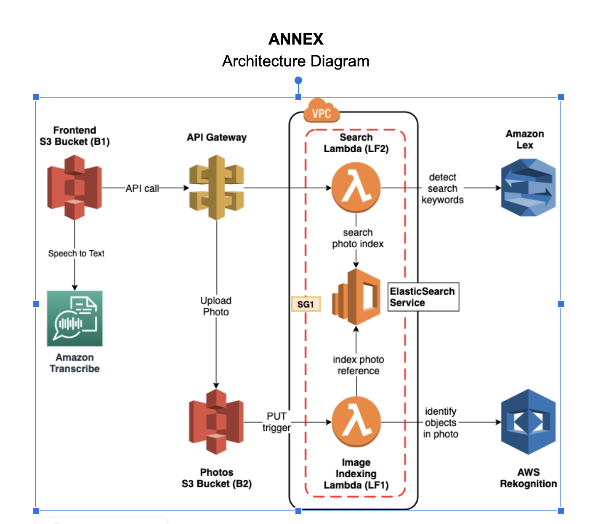

# Voice-Controlled-Photo-Album
Web Application for allowing easy image management, with quick searching using text and speech. It is entirely hosted on AWS, with AWS Codepipeline for CI/CD.
It utilizes Lex, ElasticSearch, and Rekognition to create an intelligent search layer to query your photos for people, objects, actions, landmarks and more.

## Architecture

